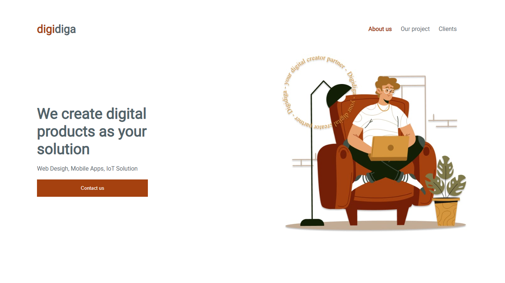

# digidiga

<h3 align="center">
<a href="https://kellycns.github.io/digidiga/">Acessar a demonstração</a>
</h3>

 

## 📖 Sobre
O digidiga é uma landing page que foi desenvolvido durante o curso de desenvolvimento Full Stack na [Tera](https://somostera.com/) e teve como objetivo treinar os conhecimentos adquiridos nas aulas de HTML e CSS.

 

## 💻 Tecnologias usadas
- [HTML5](https://developer.mozilla.org/pt-BR/docs/Web/HTML)
- [CSS3](https://developer.mozilla.org/pt-BR/docs/Web/CSS)

 

## 🤓 Fun fact
Primera vez que apliquei [media query](https://developer.mozilla.org/pt-BR/docs/Web/CSS/Media_Queries/Using_media_queries) para deixar responsivo.

 

👩‍💻 Desenvolvido por [Kelly Santos](https://github.com/Kellycns) - 2022
